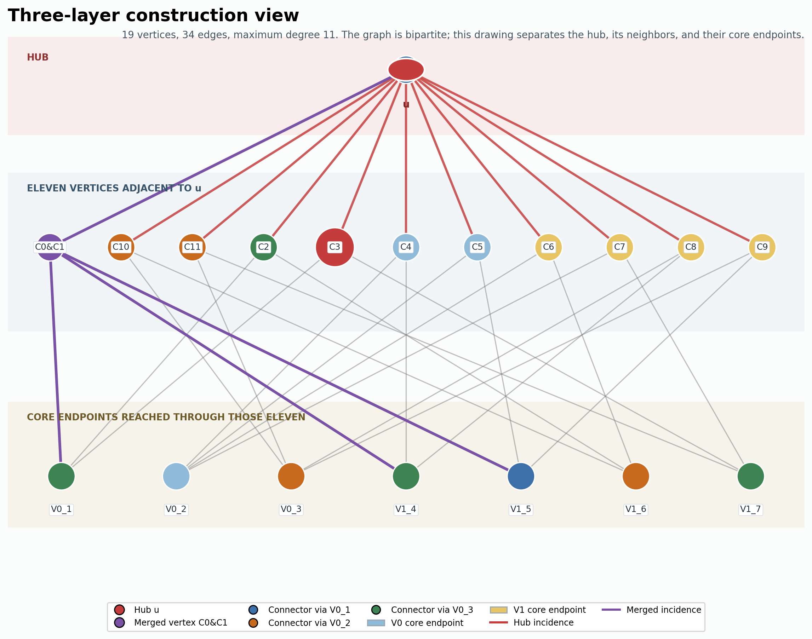
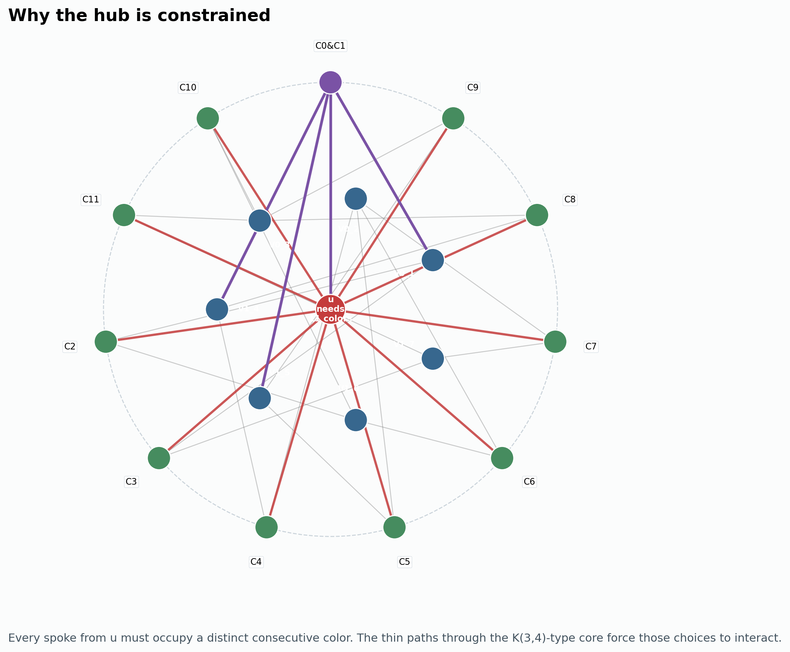
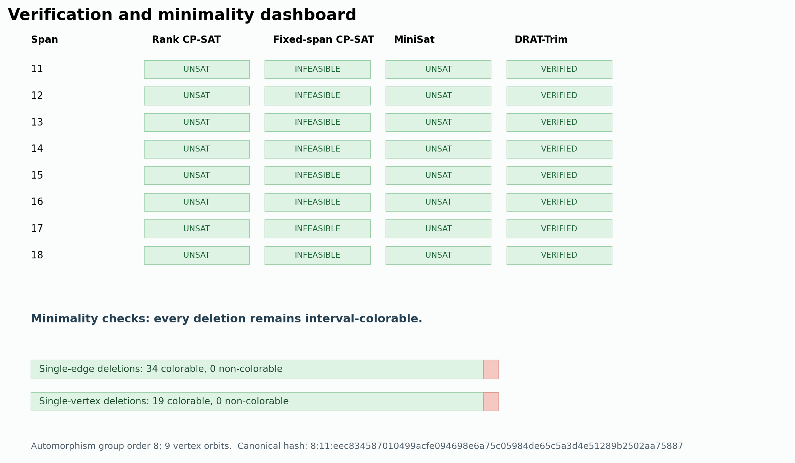
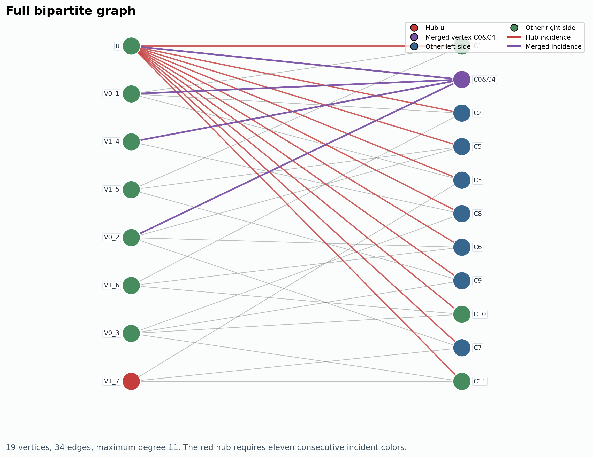
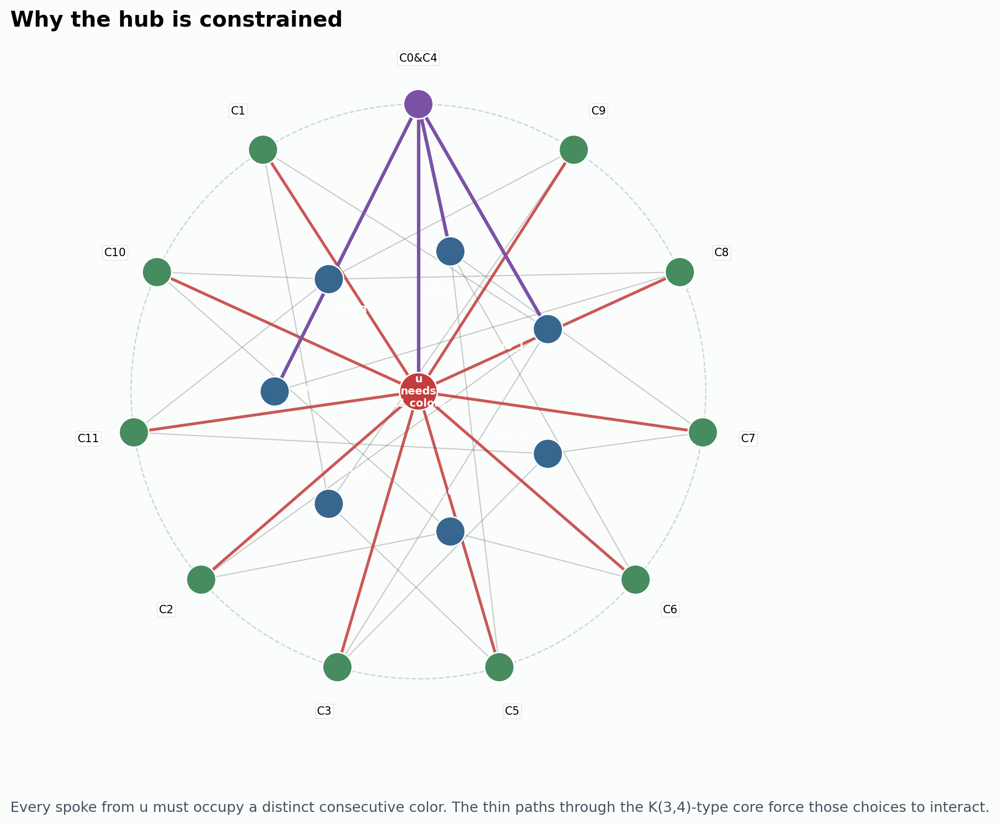

# New interval-non-colorable bipartite graphs

Status: verified candidates, 2026-08-22. These are **new graphs**, not new records: they have the same 19-vertex order as the previously known smallest examples and the same maximum degree 11 as the previous smallest known maximum degree.

## Candidate Q1-00012

- Simple, connected, bipartite graph with bipartition sizes 8 and 11.
- Order 19, size 34, maximum degree 11, minimum degree 3.
- Construction: identify connectors `C0` and `C1` in the reconstructed 20-vertex, maximum-degree-11 benchmark `hat_K34_prime_Delta11`.
- Bipartition-colored canonical hash:
  `8:11:eec834587010499acfe094698e6a75c05984de65c5a3d4e51289b2502aa75887`.
- Automorphism group order 8; 9 vertex orbits.

**Figure 1.** Three-layer construction view: `u` is in the top layer, all eleven vertices adjacent to `u` are in the middle layer, and their core endpoints are in the bottom layer. Purple marks the merged connector.

**Figure 2.** A hub-centered reading of the same graph. Thick spokes are the hub incidences. Thin paths through the core couple those color choices, preventing every span from 11 through 18.

**Figure 3.** Independent verification outcomes for every possible span, together with exhaustive single-edge and single-vertex minimality checks.

## Candidate Q1-00014

- Simple, connected, bipartite graph with bipartition sizes 8 and 11.
- Order 19, size 34, maximum degree 11, minimum degree 2.
- Construction: identify connectors `C0` and `C4` in `hat_K34_prime_Delta11`.
- Bipartition-colored canonical hash:
  `8:11:2412ce4d084d92cdaa41c7e1a009e8011de4be9e281a3fe6349eb7fc057ef9a0`.
- Automorphism group order 12; 9 vertex orbits.

**Figure 4.** The second discovered graph in three-layer form: hub `u`, its eleven neighbors, and the core endpoints reached through them. Purple marks the merged connector `C0&C4`.

**Figure 5.** Hub-centered view of Q1-00014. This layout shows why a low-degree local structure can still force a long interval at one vertex: all eleven outer spokes interact through the inner core paths.

**Figure 6.** Verification and minimality summary for Q1-00014. Every legal span has four independent exact checks, while every deletion check returns to interval-colorable status.

## Exact verification

For both graphs and every span `t=11,...,18`:

1. the rank-potential CP-SAT model is infeasible;
2. the independent fixed-start/fixed-color CP-SAT model is infeasible;
3. the exported DIMACS instance is unsatisfiable under MiniSat;
4. PicoSAT produces a DRAT proof, and DRAT-Trim reports `s VERIFIED`.

The legal span range is exhaustive because a connected bipartite graph on 19 vertices has span at most 18.

Controls used for the encodings include `K(3,5)`: MiniSat reports UNSAT at spans 5 and 6 and SAT at span 7. The published rosette `M(5,5,5)` is UNSAT at all legal spans.

## Minimality

For each candidate, the exact rank-potential oracle checked:

- all 34 single-edge deletions: all colorable;
- all 19 single-vertex deletions: all colorable;
- no deletion solve timed out.

Thus both candidates are edge-minimal and vertex-minimal under deletion checks.

## Novelty scope

The two graphs are non-isomorphic to each other and to the five reconstructed published benchmarks: `Delta(5,5,5)`, `Erd(2,2,2,2,2,2,1)`, hat `K(3,4)`, its degree-11 edge deletion, and hat `K(2,2,2)`. A same-day arXiv/OpenAlex literature recheck found no direct newer hit for interval-non-colorable bipartite graphs. The novelty claim is therefore narrowly to the documented 2026-08-22 baseline and these reconstructed benchmarks, not an exhaustive claim over every unpublished or hard-to-index source.

## Exhaustive small-order searches

On 2026-08-23, we extended the search for a graph with fewer than 19 vertices. Each connected candidate was classified by the exact rank-potential CP-SAT oracle over its full legal span range; regular bipartite graphs were skipped only when invoking their standard interval-coloring argument.

| order | bipartitions covered | generated | nonregular solved | regular skipped | negatives | timeouts |
|---:|---|---:|---:|---:|---:|---:|
| 10 | all splits, minimum degree at least 2 | 1,455 | 1,450 | 5 | 0 | 0 |
| 11 | all splits, minimum degree at least 2 | 6,956 | 6,949 | 7 | 0 | 0 |
| 12 | all splits, minimum degree at least 2 | 102,657 | 102,644 | 13 | 0 | 0 |
| 13 | all splits, minimum degree at least 2 | 830,392 | 830,392 | 0 | 0 | 0 |
| 14 | all splits, minimum degree at least 2 | 20,657,796 | 20,657,758 | 38 | 0 | 0 |

Every processed graph has a distinct bipartition-colored canonical hash within its bipartition-size class. Across all side splits, a connected bipartite graph's two part sizes are an isomorphism invariant (up to interchange), so there are no cross-class duplicates. Thus no minimum-degree-2 connected counterexample exists on 10–14 vertices.

The larger classes were processed on the YSU `research_cpu` partition as deterministic nauty-residue slices, using four CPU slots per slice. The order-14 sweep used up to 512 slices and completed all 20,657,796 candidates. Two records hit the two-second sweep cap; both were reclassified exactly with a one-hour limit and were colorable, so the table reports no unresolved timeouts. The order-14, 7+7 class had 38 regular graphs covered by the regular-bipartite coloring theorem.

In the Δ≤10 targeted lane, a bounded two-terminal signature search produced 476 unique graphs (280 strict-concatenator and 196 broader forced-offset), all colorable. A corrected 12-connector chained-synchronization search also produced 73 unique graphs, all colorable. No new counterexample was found.

## Order-15 progress and completed Δ≤10 rounds

On 2026-08-23, streaming audits completed the three remaining order-15 connected, minimum-degree-2 classes:

| class | files | records | degree range | size range | outcome |
|---|---:|---:|---:|---:|---|
| `order15-small` | 64 | 16,408 | 2–13 | 22–44 | all colorable |
| `order15-5x10` | 128 | 1,583,646 | 2–10 | 20–50 | all colorable |
| `order15-6x9` | 512 | 43,739,172 | 2–9 | 18–54 | all colorable |

The 704 chunks contain 45,339,226 records. Every index and every bipartition-colored canonical hash is distinct within its class; there are no duplicate indices, non-colorable classifications, or timeouts.

The committed Δ≤10 rounds are also closed. Round 2 generated 4,034,560 candidates and completed 1,260 unique compositions; round 3 generated 25,872 configured candidates and completed 12 unique compositions. All 1,272 completed compositions are colorable. Both searches exhausted their configured families, with zero timeouts, conflicting classifications, or independently confirmed negatives.

The remaining order-15 class was `7+8`, with exactly 243,304,742 canonical records. All 512 deterministic Slurm slices completed. A one-pass final audit scanned 243,290,613 result rows: every zero-based index and bipartition-colored canonical hash was distinct, there were no malformed rows, and no graph was classified non-colorable. The three initial five-second timeouts were rerun independently with a one-hour limit; all became colorable at spans 11, 12, and 13. The remaining 14,129 rows are the timeout rows rewritten in place by those exact reruns rather than unseen graphs.

Thus every connected minimum-degree-2 bipartite graph on 10--15 vertices has now been checked: 288,643,968 canonical order-15 candidates in total, with no counterexample and no unresolved timeout. The final audit and exact reruns are `results/order15-7x8-final-audit.json` and `results/order15-7x8-timeout-*.json`.

## Targeted order 16 and degree-bound transformations

A complete connected `5+11` order-16 census with degrees from 2 through 11 contains 5,158,975 graphs. Exact classification of the last 5,000 records selected the 100 highest weighted-hub-margin unique candidates: all 100 were colorable, with no timeouts. This was a prioritized bounded probe, not an exhaustive order-16 proof. The summary is `results/targeted-order16/5x11-summary.json`; compact classification records are under `results/targeted-order16/classification/`.

Structural analysis of 6,964 unique colorable near misses and all available negative controls found that `hub_best_margin >= -1.5` is the strongest broad separator: it retains every verified negative while admitting only 31 false positives. It is used for ranking, not as a proof.

A bounded rooted-gadget transfer search starting from the two new graphs and five reconstructed high-degree benchmarks generated 88,686 replacements and retained 3,495 unique Δ≤10 graphs. Every graph was colorable and no solve timed out. Five parents exhausted their replacement families; two stopped at explicit 1,500-candidate caps, so the lane is bounded but not globally exhausted. Report: `results/degree-transfer-delta10.json`.

A set-system search enumerated 372,570 irregular pairwise-intersecting block multisets with weighted connector points. It classified 743 unique highest-priority candidates at final maximum degree at most 10: all were colorable, with zero timeouts. Generation and classification of the configured prioritized family are complete. Report: `results/set-system-delta10.json`.

Ordinary edge subdivision is closed as a degree-reduction operation by a direct invariant argument: replacing edge `xy` with a longer `x`--`y` path leaves the degrees of both original endpoints unchanged. Consequently no ordinary subdivision of a parent with maximum degree above 10 can produce maximum degree at most 10. An earlier saved artifact came from swapped cap/degree arguments and has been removed; the corrected exhaustive feasibility report is empty (`results/subdivision-delta10-audited.json`). Vertex splitting remains open and is searched separately.

The corrected same-side vertex-splitting family generated 56 unique candidates from the available negative seeds and reconstructed benchmarks, enforcing at least degree 2 on every replacement copy and final Δ≤10. All 56 were exactly colorable with zero timeouts (`results/vertex-split-delta10.json`).

A bounded order-18 rewiring and reverse-extension search generated 123,506 candidates and retained 12,983 unique connected minimum-degree-2 graphs after bipartition-colored Nauty deduplication. The 64 highest structural-margin candidates all solved colorable, with zero timeouts. This is a targeted search, not an order-18 census (`results/order18-targeted-v2.json`).

The resumed degree-transfer extension passed the old Erdős–Fano cap: 89,207 additional replacements produced 1,256 new unique Δ≤10 graphs beyond the prior report. Together with 244 recovered checkpoint classifications, 1,500 unique graphs in this parent's extension are classified; every solve is colorable and no timeout occurred. Extension of the Δ15 parent is in progress.

The extension then completed both capped parents. Across 198,954 additional constructions, 2,756 newly solved unique candidates plus 244 recovered rows gave 3,000 combined extension classifications: Erdős–Fano 1,256 and Δ15 benchmark 1,500. All 3,000 were colorable, with zero timeouts; combined with the baseline, the represented transfer total is 6,495 unique colorable graphs (`results/degree-transfer-delta10-extension-resumed.json`).

A second order-16 tail expansion scanned exactly the final 20,000 records (indices 5,138,975 through 5,158,974), selected 50 high-margin candidates disjoint from the original 100, and classified all 50 as colorable with zero timeouts (`results/targeted-order16/tail-expansion-v2.json`).

A third expansion scanned the final 100,000 `5+11` records. All were eligible and distinct; after excluding the 150 previously classified indices, the strongest 500 new candidates were solved exactly: 500 colorable, no negatives, no timeouts (`results/targeted-order16/expansion-v3-summary.json`).

The deeper same-side vertex-split search corrected a seed-selection defect in its first implementation, then exhaustively classified its bounded multi-split family: 440 constructions produced 224 unique Δ≤10 graphs. All 224 were colorable, with zero timeouts (`results/vertex-split-delta10-v2.json`).

The third degree-transfer pass added another 177,021 constructions and classified 5,152 additional unique Δ≤10 graphs: 740 for Erdős–Fano and 4,412 for the Δ15 benchmark. Every classification returned colorable, with zero timeouts. The combined transfer evidence now represents 11,647 unique colorable graphs (`results/degree-transfer-delta10-extension-r3.json`).

The synchronized multi-hub splitting lane replaced each over-cap hub by two same-side copies and joined them through bounded bipartite synchronization gadgets. Its configured exhaustive family generated 2,388 candidates and retained 1,491 unique Δ≤10 graphs. All were exactly colorable, with no primary negative and no timeout (`results/multihub-sync-delta10.json`).

Order-16 progress is now as follows:

| class | canonical records | outcome |
|---|---:|---|
| `4+12` | 26,330 | all colorable |
| `5+11` | 5,158,975 | all colorable |
| `6+10` | 291,917,907 | classification running |
| `7+9` | 3,604,370,591 | staged classification running |
| `8+8` | to be determined after generation | generation running |

A reusable memory-safe audit tool (`src/audit_order16_class.py`) streams result chunks directly from YSU, checks malformed rows, duplicate indices, duplicate bipartition-colored hashes, status counts, timeout indices, and expected-count agreement. It reproduced both completed order-16 audits exactly on `4+12` and `5+11`.

The initial `7+9` count of 121,471,162 was a partial count from a locally timed-out enumeration. The completed cluster generation produced exactly **3,604,370,591** graph6 records (79.3 GB), with SHA256 `902e940b2af30043d2a757e2825c0b274a2dd769465313eba533e66fe2dc5270`. Classification is therefore staged: batch 0 is Slurm array `228989`, chunks 0--999 with at most 150 running tasks; later batches will follow until all 8,192 planned chunk boundaries are covered.

The third degree-transfer pass added another 177,021 constructions and classified 5,152 additional unique Δ≤10 graphs: 740 for Erdős–Fano and 4,412 for the Δ15 benchmark. Every classification returned colorable, with zero timeouts. The combined transfer evidence now represents 11,647 unique colorable graphs (`results/degree-transfer-delta10-extension-r3.json`).

A one-pass live audit of 345 available order-15 `7+8` chunks checked 129,324,159 rows on YSU job 227326: all indices and bipartition-colored canonical hashes were distinct, there were zero malformed rows, zero timeout rows, and all rows were colorable. This is a clean snapshot at 53.153% of the expected 243,304,742 records, not yet completion of the class.

Machine-readable totals and artifact hashes are in `results/order15-completed-classes-summary.json`; the underlying audits are `results/order15-{small,5x10,6x9}-audit.txt`, and the targeted rounds are `results/lane6-signature-r2.json` and `results/lane6-signature-r3.json`.

## Artifacts

- `results/candidates/Q1-00012/` — graph, CNFs, DRAT proofs, checker logs, certificate, manifest.
- `results/candidates/Q1-00014/` — same certificate bundle.
- `results/quotient-r1.json` — full 19-vertex quotient search.
- `results/quotient-r2.json` — 412 unique 18-vertex quotients, all colorable.
- `results/quotient-r3.json` — 5,066 unique 17-vertex quotients, all colorable.
- `results/logs/search-5x5.log` — exact classifications for all 558 connected 5+5, 14-edge graphs.
- `results/all-gap-audits.txt` — grouped completeness/uniqueness audit for the remaining side-split families through order 13.
- `data/order{10,11,12,13}-*.g6` — canonical nauty inputs for every remaining side split.
- `results/small-order-11-5x6.jsonl` — exact classifications for all connected 5+6, minimum-degree-2 graphs.
- `results/small-order-12-6x6.jsonl` — exact classifications for all connected 6+6, minimum-degree-2 graphs.
- `results/order11-5x6-audit.txt`, `results/order12-6x6-audit.txt`, and `results/order13-6x7-audit.txt` — completeness and uniqueness audits.
- `data/order13-6x7-d2.g6` — canonical nauty input used by the 128-way Slurm run.
- `results/order14-search-summary.json` — complete order-14 census, audits, and timeout resolutions.
- `results/order14-*-audit.txt` — streaming completeness/uniqueness audits for every order-14 side split.
- `results/order14-{6x8,7x7}-timeout-rerun.json` — exact longer-limit reruns of the two sweep-timeout records.
- `data/order14-*-d2.g6` — canonical nauty inputs for all order-14 side splits.
- `results/lane6-signature-strict.json`, `results/lane6-signature-forced.json` — bounded Δ≤10 terminal-signature searches.
- `results/lane6-chained-sync-corrected.json` — corrected 12-connector synchronization search.
- `results/literature-recheck-2026-08-22.json` — literature-query snapshot.
- `results/literature-targeted-openalex-2026-08-22.json` — targeted exact-phrase OpenAlex query.

## Tool versions

- Python 3.10.12 (WSL Ubuntu 22.04).
- OR-Tools CP-SAT 9.15.6755.
- MiniSat 2.2.
- PicoSAT 965, built with trace generation.
- DRAT-Trim commit `2e3b2dc0ecf938addbd779d42877b6ed69d9a985`.
- Nauty/pynauty 2.7.3 for bipartition-colored canonical certificates and automorphism groups.

## Final bundle audit

On 2026-08-22, an automated audit reloaded both candidate bundles and confirmed:

- graph order/size/degree and bipartition invariants;
- agreement of stored colored canonical hashes;
- CP-SAT fixed-span exclusion of every span 11 through 18;
- MiniSat UNSAT status for every span 11 through 18;
- PicoSAT/DRAT-Trim verification of every span 11 through 18;
- zero negative edge or vertex deletions and zero minimality timeouts;
- pairwise non-isomorphism to all five reconstructed benchmarks;
- every non-manifest file hash listed in each manifest.
